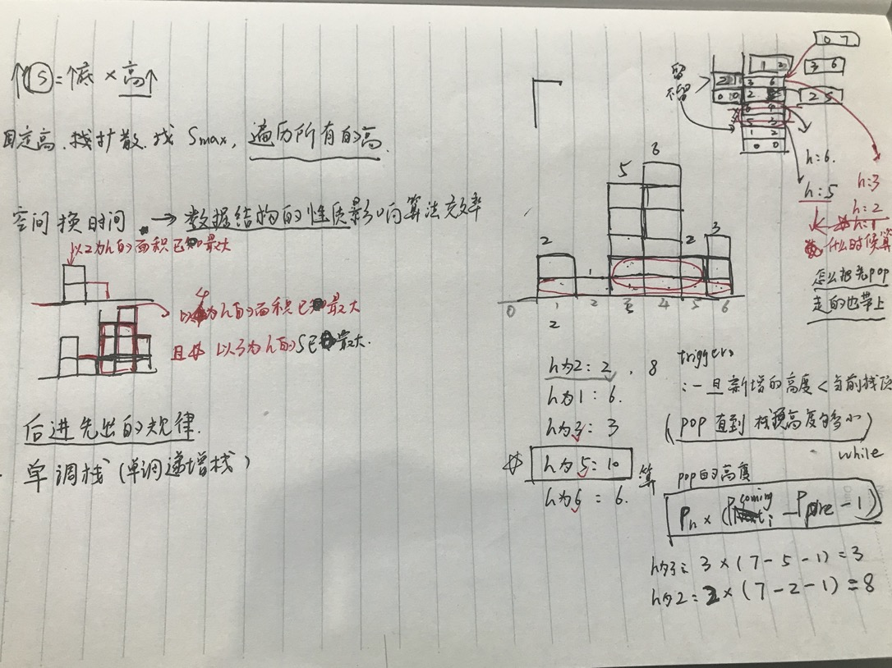
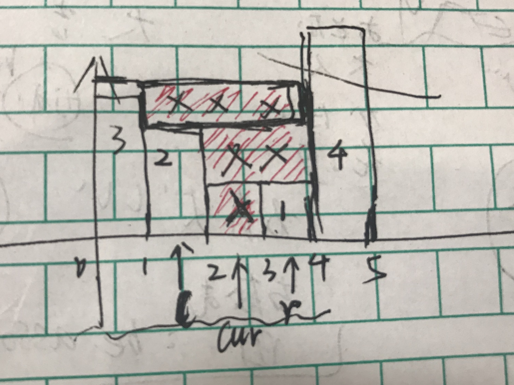

堆栈溢出:

实现中还存在着递归调用。递归调用的效率是很低的，因为牵扯到大量的函数调用，即栈帧的创建与释放。而且由于临时变量的存在以及需要保存之前栈帧的esp、程序计数器等寄存器值，在递归层数加深时会占用大量的栈空间，非常容易引起爆栈。


# 单调栈：

##  84. 柱状图中最大的矩形

如何列举出所有的可能，不重不漏




```js
/**
 * @param {number[]} heights
 * @return {number}
 */

const IncreStack = {
    val: [],
    // 空栈栈顶和pop 结果返回undefined
    top: function(){
        return this.val[this.val.length - 1];
    },
    pop: function(){
        return this.val.pop();
    }
};

var largestRectangleArea = function(heights) {
    let re = 0;

    // 矩阵后添加一个height为0的矩阵
    // increStrack 存的是index
    // 但是单调栈维护 以heights为准
    // 注意：代码实现的是严格递增
    const increStack = Object.create(IncreStack);
    heights.push(0);

    const updateResult = (comingIndex) => {
        const cur = increStack.pop();
        // 栈里面前一个数、也就是下一个栈顶
        // 如果已经是空栈了 这里赋值 -1 是为了
        // (comingIndex - pre - 1) * heights[cur] 
        let pre = increStack.top() === undefined ? - 1 : increStack.top();
        let tmp = (comingIndex - pre - 1) * heights[cur];
        re = re > tmp ? re : tmp;
        return pre;
    };

    increStack.val = [0];
    for(let i = 1; i < heights.length; i++){
        let top = increStack.top();
        while(heights[i] < heights[top]){
            top = updateResult(i);
        }
        if(top === -1 || heights[i] > heights[top]){
            increStack.val.push(i);
        }else if(heights[i] === heights[top]){
            // 注意：如果有相等高度，拿最新的替换掉，
            increStack.val[increStack.val.length - 1] = i;
        }
    }
    return re;
};

```

## 42 接雨水 
给定 n 个非负整数表示每个宽度为 1 的柱子的高度图，计算按此排列的柱子，下雨之后能接多少雨水。


如果可以知道max left 和 max right. 
计算方法:
```
对于每一个柱子 min(max_left, max_right) - height[i]
```

如果使用单调栈：
```
(r - l - 1) (min(height(left),height(right))-height(cur))

这个其实是高度：
min(height(left),height(right))-height(cur)

这个是长：
(r - l - 1) 
```




---

# todo :

1. Dijkstra算法 
2. 查并集：https://leetcode-cn.com/problems/swim-in-rising-water/
3. dynamic problem : http://poj.org/problem?id=2663
4.  编辑距离（很难想到子问题的动态规划）
```
问题定义：
我们定义dp[i][j]的含义为：word1的前i个字符和word2的前j个字符的编辑距离。意思就是word1的前i个字符，变成word2的前j个字符，最少需要这么多步。

子问题：
dp[i][j] = min( dp[i-1][j] + 1, dp[i][j-1] + 1, dp[i-1][j-1] + int(word1[i] != word2[j]) )

为什么分这三步： 因为猜如果用自底向上的话，一定是两个word的数目都变小，这样的话，他们之间的关系是什么？

0. 
    A->B
    B->A

1. 在单词 A 中插入一个字符：如果我们知道 horse 到 ro 的编辑距离为 a，那么显然 horse 到 ros 的编辑距离不会超过 a + 1。这是因为我们可以在 a 次操作后将 horse 和 ro 变为相同的字符串，只需要额外的 1 次操作，在单词 A 的末尾添加字符 s，就能在 a + 1 次操作后将 horse 和 ro 变为相同的字符串；

horse -> ro a
horse -> ros ? a+1

2. 在单词 B 中插入一个字符：如果我们知道 hors 到 ros 的编辑距离为 b，那么显然 horse 到 ros 的编辑距离不会超过 b + 1，原因同上；

hors -> ros b
horse -> ros ? b+1

3. 修改单词 A 的一个字符：如果我们知道 hors 到 ro 的编辑距离为 c，那么显然 horse 到 ros 的编辑距离不会超过 c + 1，原因同上。

hors -> ro c
horse -> ros ? 最大 c+1

那么从 horse 变成 ros 的编辑距离应该为 min(a + 1, b + 1, c + 1)。

寻找问题定义和子问题定义的突破口：
1. base cases
2. 最优子结构
3. 最基本的自底向上 寻找子问题的定义和子问题之间的关系
```
5. 思维陷阱
```
 49. 字母异位词分组

输入: ["eat", "tea", "tan", "ate", "nat", "bat"]
输出:
[
  ["ate","eat","tea"],
  ["nat","tan"],
  ["bat"]
]

错误思路：
ate ->放到categoty这个object里面
{
    a: [{a:0,t:1,e:2}]
}
{
    t: [{a:0,t:1,e:2}]
}
{
    e: [{a:0,t:1,e:2}]
}
对于新的单词eat 在categoty.e的数组里找有没有一个集合其中（eat的所有元素都在集合中出现而且长度相等）
但是这和 ’字母异位词分组‘ 的命题不一致

**如果有重复的单词的时候就有问题。**
-- 问题转化的时候一定要多动动脑子 好好想一想

正确：
排序 / 计数（直接计数的结果编码成可以直接比较的那种 /
```


---


# 算法，主要是以下几种：
基础技巧：分治、二分、贪心
排序算法：快速排序、归并排序、计数排序
搜索算法：回溯、递归、深度优先遍历，广度优先遍历，二叉搜索树等
图论：最短路径、最小生成树
动态规划：背包问题、最长子序列

# 数据结构，主要有如下几种：
数组与链表：单 / 双向链表
栈与队列
哈希表
堆：最大堆 ／ 最小堆
树与图：最近公共祖先、并查集
字符串：前缀树（字典树） ／ 后缀树

1. 快速感受一下常见数据结构和算法的套路，这样自己有一个感性的认识。
2. 一题多解，多题同解 
   多个角度思考问题 
   问题的本质做一些深度的理解

# 二分法 :
34. 在排序数组中查找元素的第一个和最后一个位置
  while (left <= right) {
      let mid = (left + right) >> 1;
      if (num < arr[mid]) {
        right = mid - 1;
      } else if (num > arr[mid]) {
        left = mid + 1;
      } else {
        return mid;
      }
    }
    return left;

## 树的分支的遍历 和 组合 
**有限的组合--可以通过循环解决--既不重复，也不缺失的都试一遍**
**递归--回退**
笛卡尔积的列举（两元排列组合） 推演到多个的时候 
（18题是四元排列组合）
如何去重（唯一）完备怎么保证？